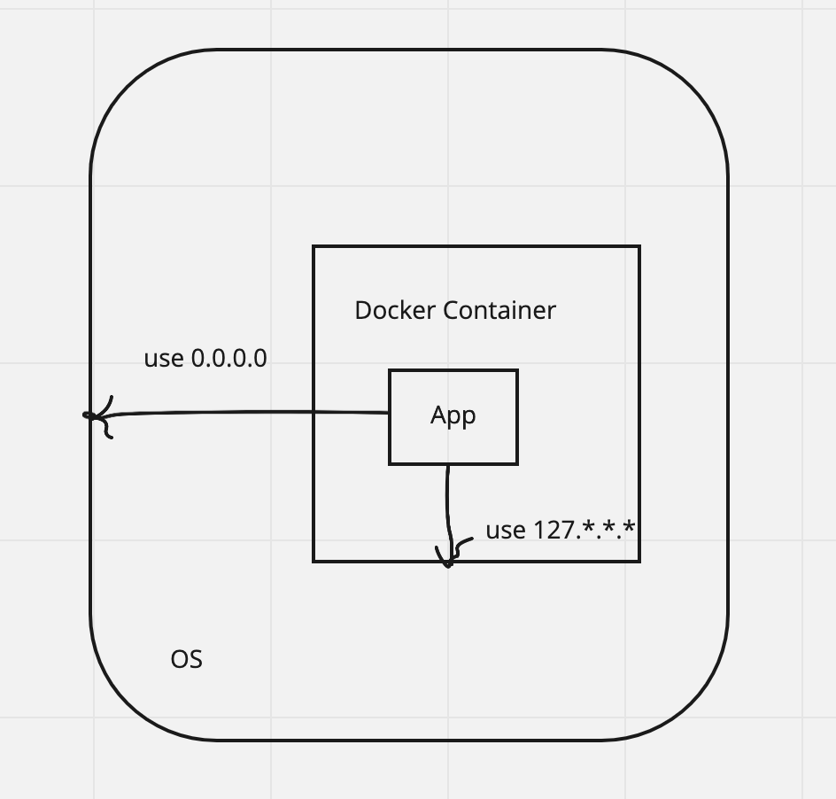

# 127.0.0.1 vs 0.0.0.0

由一个问题引发的学习。

## 问题

容器中监听了 `0.0.0.0:<port>` 的进程和 `127.0.0.1:<port>` 的进程，前者可从宿主机访问到，后者则不可。为什么？

```shell
curl '127.0.0.1:<port>'
# curl: (56) Recv failure: Connection reset by peer
```

## 问题分析

进程监听 socket，底层是调用系统函数 `bind(2)`，有 2 个参数。

1. **网络接口**：OS 上可能有多个网络接口，如 `eth0`。其中 `127.0.0.1` 指本机接口，`0.0.0.0` 指任意接口（类比通配符 `*`）。监听的网络接口表示只接收来自该接口的网络请求；
1. **网络端口**：只接收来自该端口的网络请求。

> 云服务器设置安全组时，常见 `0.0.0.0`。

在 container 中，`127.0.0.1` 特指本 container（非宿主机）。监听该网络接口则表示只接收来自本 container 的网络请求。那么，它不会接收来自本 container 外部（包括宿主机）的网络请求。但 `0.0.0.0` 则会，因为它表示接收来自任意接口的网络请求。



## 解决方案

若期望到达或来自宿主机的网络请求被 container 内的进程接收，让进程监听 `0.0.0.0` 网络接口即可。

## 参考

1. [Docker app server ip address 127.0.0.1 difference of 0.0.0.0 ip](https://stackoverflow.com/questions/59179831/docker-app-server-ip-address-127-0-0-1-difference-of-0-0-0-0-ip)
1. [What is the difference between 0.0.0.0, 127.0.0.1 and localhost?](https://stackoverflow.com/questions/20778771/what-is-the-difference-between-0-0-0-0-127-0-0-1-and-localhost)