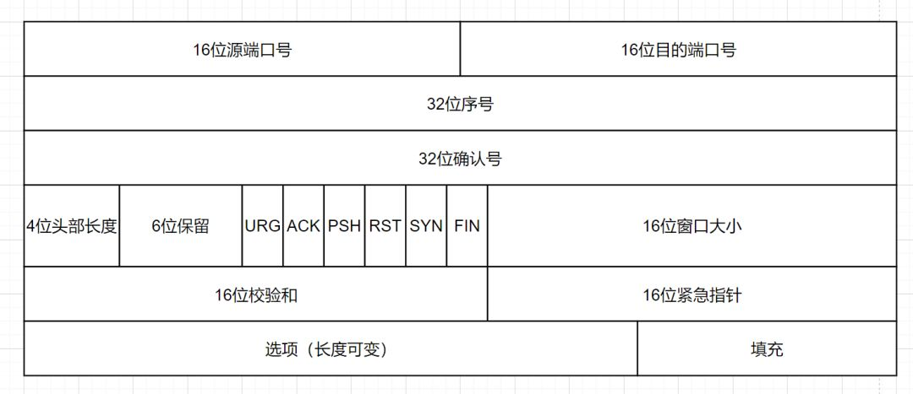
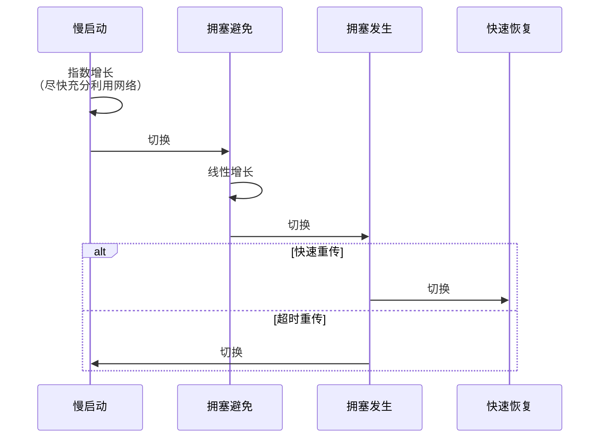

# TCP

TCP 是一个**可靠**的传输层网络协议，它可确保数据传输的准确性、完整性和有序性。

为达成可靠目标，协议占用了包容量（即 Header）并规定了较为复杂的流程，牺牲了性能。

## 包

将包分为了两部分。

最大值

### Header

存放元数据。

这些字段配合规定的流程，用于达成**可靠**目标。

### Body

存放传输的数据。

## 建立连接

> 因共需三次连接，又称“三次握手”。

> **为什么比断开连接少一次？**
>
> 第二次被复用。同时用于 `ACK` 和 `SYN`，因此节省了一次。

## 断开连接

> 因共需四次连接，又称“四次挥手”。

> **为什么比建立连接多一次？**
>
> 因服务端可能有包未发完，第二次没法复用。这也是 `CLOSE_WAIT` 存在的原因。

> **为什么客户端需 `TIME_WAIT`？**
>
> 为达成可靠机制。发出的 `ACK` 包可能丢失，此处留出重发时间。

> **为什么 `TIME_WAIT` = 2 * MSL?**
>
> * **1 MSL**: 触发超时重传；
>
> * **1 MSL**: 重传的 `FIN` 传输耗时。

## 可靠机制

### 完整性

#### 确认应答

#### 丢包重传

##### 快速重传

触发条件 | 缺点 | 优化方案
--- | --- | ---
三重 ACK | 不知丢哪个包 | SACK

    
SACK

    

        
S: Selective。在 Header 的<code>选项</code>空间加 SACK 字段，标记已收到的连续 <code>seq</code> 区间。

    
    
    

##### 超时重传

触发条件 | 缺点 | 优化方案
--- | --- | ---
RTO | <ul><li>时延</li><li>重传重复</li></ul> | D-SACK

> **RTO**: 略大于 RTT。

    
D-SACK

    

        
D: Duplicate。在 <code>SACK</code> 中附加重复接收的 <code>seq</code>。

        
    

### 准确性

#### 校验和

### 有序性

#### 序列号

## 传输控制

### 流量控制

#### 滑动窗口

一发一确认的回合模式效率低。借助*窗口*来实现批发。

窗口同步：接收方在 ACK 包 `win` 字段填写其空闲的窗口大小；发送方借此确定批发包数。

> `win = 0`，发送方通过发送*试探报文*来了解对方的状态。

    
发送窗口

    

    
接收窗口

    

### 拥塞控制

动态地根据网络情况，调整发包量。

#### 慢启动

通过 cwnd 和 ssthresh 来控制。

* cwnd: congestion window 拥塞窗口
* ssthresh: slow start threshold 慢启动阀值

**初始值**：

* cwnd = 1 MSS
* ssthresh = 2^16 = 65535 bytes

**算法**：

* 每收到 1 个 ACK，cwnd += 1
* 每过 1 个 RTT，cwnd *= 2 (指数增长)
* cwnd > ssthresh, 改用拥塞避免

MMS: Maximum segment size, 最大分段大小

    <ul>
        <li>单位 byte</li>
        <li>默认值 2^9 = 512 bytes</li>
        <li>Header 中的参数，可动态调整</li>
    </ul>

#### 拥塞避免

**算法**：

* 每收到 1 个 ACK，cwnd += 1/cwnd
* 每过 1 个 RTT，cwnd += 1
* 发生丢包重传，改用拥塞发生

#### 拥塞发生

#### 快速恢复

重发丢失的报，若
1. 如果再收到重复的 ACK，则 cwnd += 1
1. 如果收到新数据的 ACK, 则 cwnd = sshthresh。因为收到新数据的 ACK，表明恢复过程已经结束，可以再次进入拥塞避免

## 安全

## 备注

### 参考

* [TCP 协议经典十五连问](https://zhuanlan.zhihu.com/p/391591603)
* [TCP congestion avoidance flow](https://medium.com/tcp-ip/tcp-congestion-avoidance-flow-382bb02f4e20)
