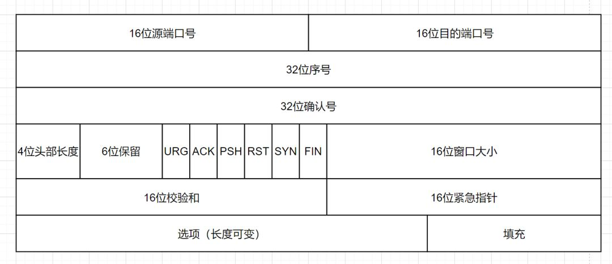

# UDP

## 报文

将包分为了两部分。

最大容量：受 Header 的 `Length` 字段 (2^16 byte) 限制。

### Header

存放元数据。

这些字段配合规定的流程，用于达成**可靠**目标。

### Payload

存放传输的数据。

## UPD VS. TCP

TCP | UDP
--- | ---
有连接 | 无连接
可靠 | 高效
面向字节流 | 面向报文
一对一传输 | 一对一、一对多、多对多传输
适合网页 | 适合音视频
