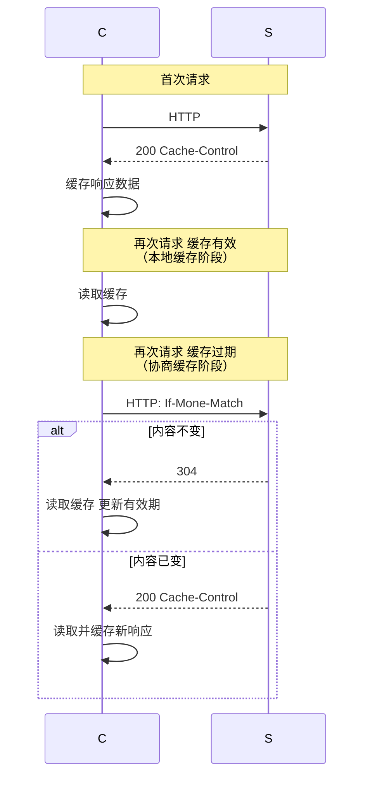
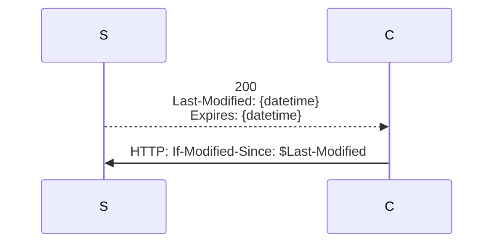
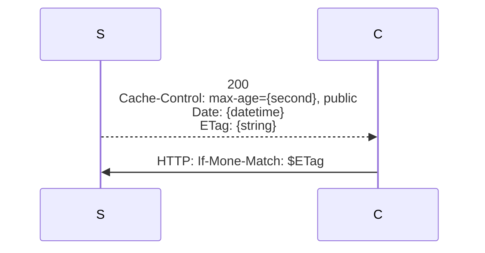
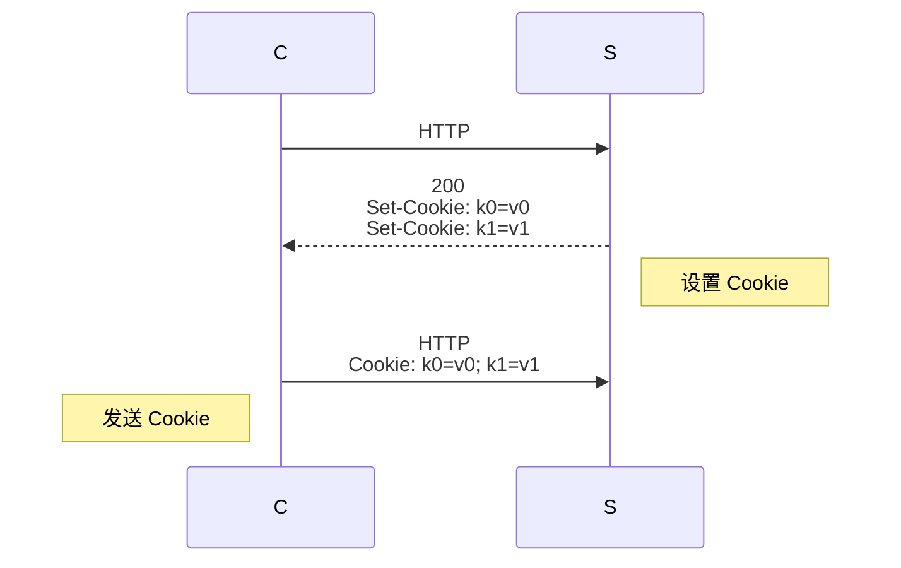
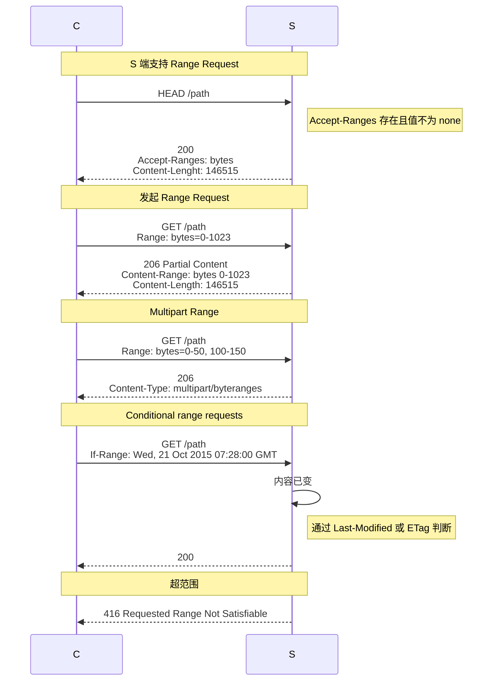
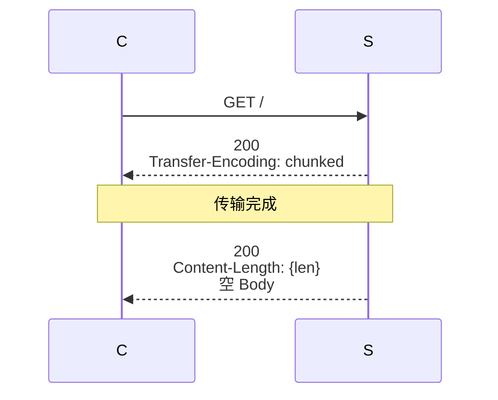
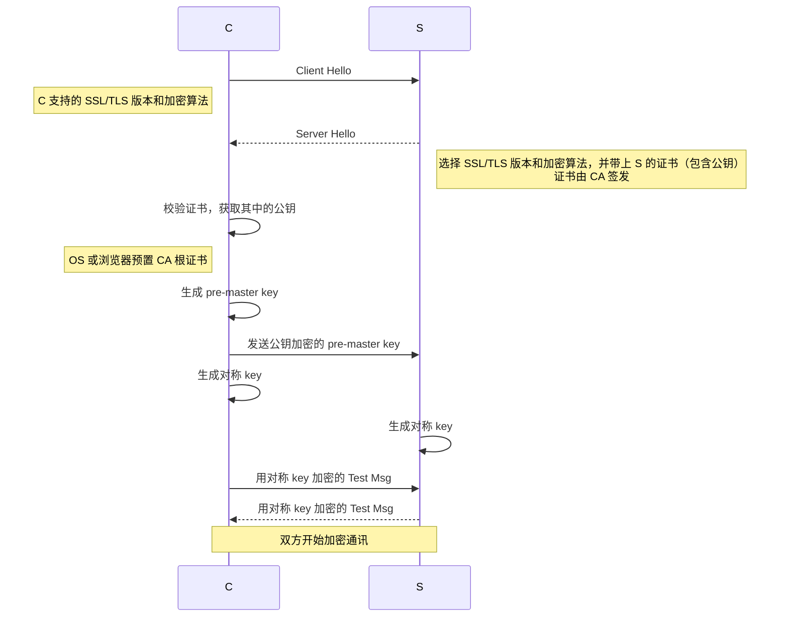

# HTTP

## 组成结构

### Header

存放请求或响应的元数据。

```http title="请求头"
GET /example.html HTTP/1.1
Host: example.com
```

```http title="响应头"
302 Found
Location: /NewPage.html
```

### Body

存放请求或响应数据。

## 请求方法

表示请求的动作。

### 常见方法

* `GET`: 获取
* `POST`: 提交
* `PUT`: *完全*覆盖更新
* `PATCH`: *部分*覆盖更新
* `DELETE`: 删除

## 响应状态码

表示响应的状态。

分段 | 含义 | 常见
--- | --- | ---
`1xx` | 信息 | `101` Switching Protocols
`2xx` | 成功 | `200` OK, `201` Created
`3xx` | 重定向 | `301` Moved Permanently, `304` Not Modified
`4xx` | 客户端错误 | `400` Bad Request, `401` Unauthorized, `403` Forbidden, `404` Not Found, `409`: Conflict
`5xx` | 服务端错误 | `500` International Server Error, `502` Bad Gateway

## 缓存控制

缓存由 S 端控制，通过 HTTP 头传递控制指令。



### 协商缓存

#### HTTP 1.0



`Expires` 是绝对值，但 C 和 S 的时钟可能不一致。

#### HTTP 1.1



`max-age` 是相对值。

> `ETag` 是 S 端用来标记文件版本的值，无固定生成规则，只要做到随文件内容变化而变化即可。

> 优先使用 HTTP 1.1。

> **Disable Cache**
>
> 启用时，浏览器不使用本地缓存，且不走协商缓存（请求头不带协商缓存字段），以达到获取最新数据的目的。

## Cookie

服务需状态，但 HTTP 无状态。Cookie 是解决状态问题的方案。



### 生命周期

* Session (默认): 关闭浏览器时失效；
* Expires
* max-age

### Access

* Secure (用于 HTTPS)
* HttpOnly: 开关：Js 可否读写该 Cookie。

### Scope

* Domain (默认 Host)
* Path
* SameSite (防范 CSRF)

> **[最大值](https://stackoverflow.com/a/4604212)**： 总容量 2^12 bytes ~= 4KB。

## Range Request 断点续传

* 通过 `Range` 请求头和 `Accept-Range` 响应头实现；
* 需 C 和 S 支持。



## Chucked 流传输

* S 无需缓存完成全部响应内容，从而提升响应速度；
* 通过 `Transfer-Encoding` 响应头表明流传输（无 `Content-Length`）。



## 文件上传

* 请求头 `Content-Type: multipart/form-data`

## 认证

## 版本

### 0.9

* 仅 `GET` 方法；
* 仅 HTML 响应类型；
* 无连接保持。

### 1.0

* 丰富请求方法；
* 新增响应状态码；
* 新增 Header 字段，可自定义 Content-Type，支持压缩等。

### 1.1

* 连接保持
* 管线化：C 无需在发送后续请求之前等待 S 响应
    * 仍要求 S 按收到请求的顺序响应。若某个响应慢，后续响应都将延迟。此称**线头阻塞**

### 2

* 压缩请求头
* 解决线头阻塞：单 TCP 连接多 HTTP 请求，且允许 S 任意顺序响应，S 收到响应时重新组合；单连接中加快整个交换速度
* TCP 层线头阻塞：可靠机制
    * 在 TCP 协议级别上仍然存在类似类型的线头问题，而 TCP 仍然是 Web 的基础构建块。当 TCP 数据包在传输过程中丢失时，在服务器重新发送丢失的数据包之前，接收方无法确认传入的数据包。由于 TCP 在设计上不遵循 HTTP 之类的高级协议，因此单个丢失的数据包将阻塞所有进行中的 HTTP 请求的流，直到重新发送丢失的数据为止。这个问题在不可靠的连接上尤为突出，这在无处不在的移动设备时代并不罕见

### 3

* 要求加密
* 改用 UDP
    * 为了解决传输级别的线头阻塞问题，通过 QUIC 连接传输的数据被分为一些流。流是持久性 QUIC 连接中短暂、独立的“子连接”。每个流都处理自己的错误纠正和传递保证，但使用连接全局压缩和加密属性。每个客户端发起的 HTTP 请求都在单独的流上运行，因此丢失数据包不会影响其他流 / 请求的数据传输


## HTTPS

* 加密在传输层进行
* 加密 <- 对称 key <- 公钥 <- 证书 <- CA 根证书

**步骤**：

1. 确定 SSL/TLS 版本和加密算法
1. 认证 S
1. 非对称换对称



## 参考

* [HTTP Guide - mdn](https://developer.mozilla.org/en-US/docs/Web/HTTP/Basics_of_HTTP)
* [彻底弄懂浏览器缓存策略](https://mp.weixin.qq.com/s/Ui7Q9k4faiD5mv_LfB4Rrw)
* [从HTTP到HTTP/3的发展简史](https://mp.weixin.qq.com/s/E5RwKvHcDdzHS77lpb9wvw)
* [How HTTPS Works](https://howhttps.works)
