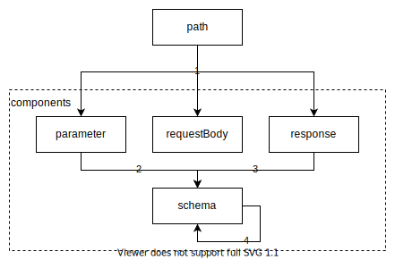

# OpenAPI (Swagger)

## 文档

[Swagger Specification](https://swagger.io/docs/specification/)。

## 工具

在 VS Code 中使用插件 [OpenAPI \(Swagger\) Editor](https://marketplace.visualstudio.com/items?itemName=42Crunch.vscode-openapi) 辅助书写，它有智能补全、实时预览（支持 [Swagger UI](https://github.com/swagger-api/swagger-ui) 和 [ReDoc](https://github.com/Redocly/redoc)）、内容索引等能力。

## 文件格式

推荐 `YAML`。辅助字符较少，好写好读。

## Markdown

可用来书写格式化内容或段落。比如，在 `info.description` 中书写前置信息。

## operationId 规则

`[<parent-resource>:]<resource>:<action>`

| Field | Required | Description |
| :--- | :---: | :--- |
| parent-resource |  | 上级资源。 |
| resource | Y | 资源。 |
| action | Y | 动作，常见的值有 `create`, `index`, `show`, `update`, `delete`。 |

### 例子

* `apps:users:index` - 索引应用中的用户；
* `users:show` - 展示一个用户。

<!--  -->

## components 复用规则

1. `path` 可引用 `parameter`, `requestBody`, `response`；
2. `parameter` 可引用 `schema`；
   * 路径参数命名格式 `:<name>`；
3. `response` 可引用 `schema`；
4. `schema` 可引用 `schema`。

另外，`parameter` 和 `requestBody` 注重 `description`。

## 更多

### 空行

借助空行来分隔代码，方便阅读。

