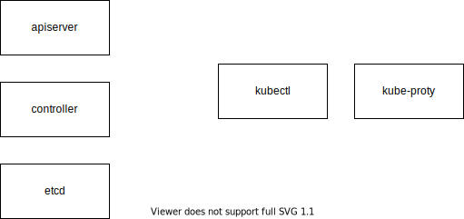

# K8s

## 资源对象

## 组件

## 参考

* [Kubernetes: An Overview](https://thenewstack.io/kubernetes-an-overview)
* [Kubernetes指南](https://kubernetes.feisky.xyz)
* [GETTING STARTED](https://kubernetes.io/docs/reference/generated/kubectl/kubectl-commands)
* [The container orchestrator landscape](https://lwn.net/Articles/905164/)
* [Why is Kubernetes getting so popular?](https://stackoverflow.blog/2020/05/29/why-kubernetes-getting-so-popular/)
