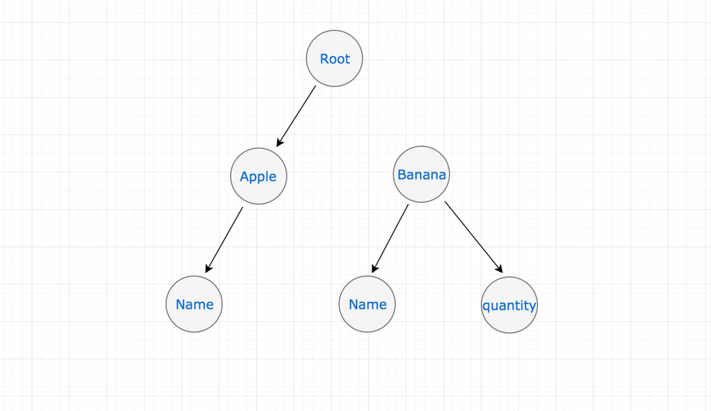
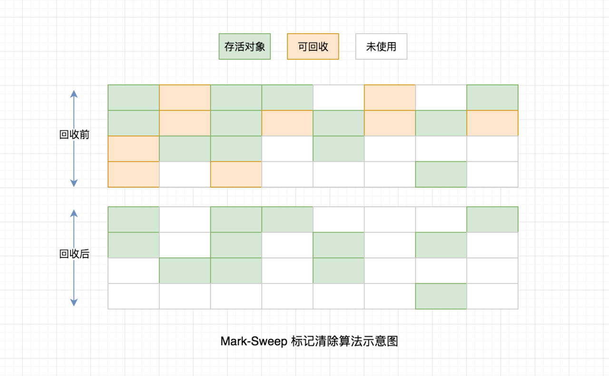
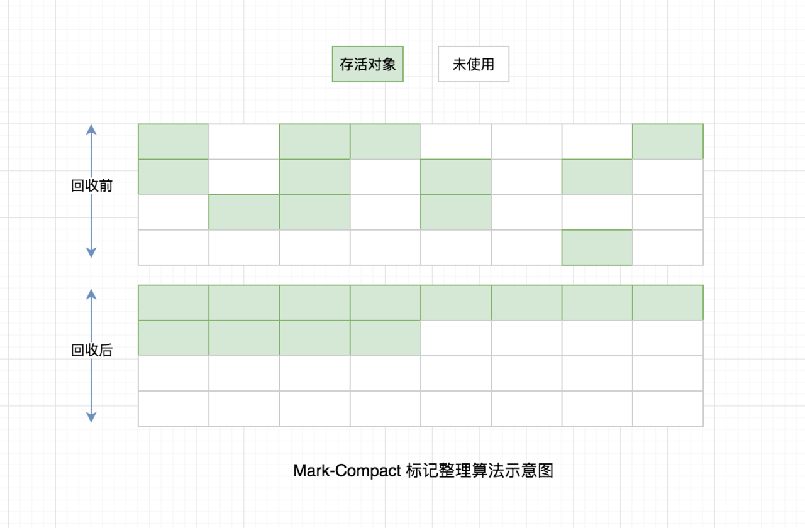

# Node.js 垃圾回收

## 什么是垃圾？

没用的变量就是垃圾。无法从 `global` 全局变量开始通过引用找到的变量就是无用的变量（已经无法用到）。 它可能是一个单一变量，也可能是一个变量孤岛。

## 垃圾回收的成本

垃圾回收有成本。需要计算和存储，它的运行会中断事件循环。

> 在 32 位机器中，V8 限制可用内存约为 0.7GB；在 64 位机器中，V8 限制可用内存约为 1.4GB。 为什么？

A: 因为内存过大导致垃圾回收时间过长，对事件循环影响过于明显。

## 内存的组成

通过 `process.memoryUsage` 来查看内存。

* `rss`: 进程所占用的内存部分，包括代码本身、栈、堆；
* `heapTotal`: 堆中申请到的总内存空间；
* `heapUsed`: 堆中已用空间；
* `external`: V8 引擎内部的 C++ 对象所占的内存。

## 程序内存特点

* 频繁地新建变量，频繁地销毁变量；
* 新生的变量中多数的存活时间短，老生的变量中多数存活时间长。

## 垃圾回收算法

### 新生代

根据该生代的内存特点，采用了 Scavenge 算法。其将内存空间分为两个等额空间 from-space 和 to-space。 将 from-space 中存活的对象复制到 to-space 中，然后释放 from-space。然后互换两个空间的角色。

### 老生代

根据该生代的内存特点，采用了 Mark-Sweep \(标记-清除\) 结合 Mark-Compact \(标记-整理\) 算法。

Mark-Sweep 速度快，但产生了很多内存碎片。结合 Mark-Compact 可让内存空间紧凑。

## 内存泄漏

* 全局变量：它们持续占有内存。慎用，可 `someGlobalVar = null` 主动释放；
* 闭包：可能导致函数外部作用域的变量持续存在；查看案例 [An interesting kind of JavaScript memory leak](https://blog.meteor.com/an-interesting-kind-of-javascript-memory-leak-8b47d2e7f156)；
* 慎将内存作为缓存：考虑 redis 等外部缓存服务；
* 模块：引进的模块会被 Node 缓存，且持续存在；
* 事件重复监听：可能会在重试机制中出现（如网络重连等），导致有超多的重复事件监听；（默认地，超过 10 个监听器时 Node 会发出警告。）
* 其他：
  * 定时器：建议主动释放，否则不会被销毁；
  * map, filter 等方法会产出新对象，占用更多内存。

## 内存优化手段

* 可知的无用的大内存，可通过将对象设置为 `null` 来主动释放。

## 参考

* [Node.js内存管理和V8垃圾回收机制](https://juejin.cn/post/6844903878928891911)
* [A tour of V8: Garbage Collection](http://jayconrod.com/posts/55/a-tour-of-v8-garbage-collection)
* [Node.js Garbage Collection Explained](https://blog.risingstack.com/node-js-at-scale-node-js-garbage-collection/?utm_source=nodeweekly&utm_medium=email)
* [Memory Management Reference](https://www.memorymanagement.org)
