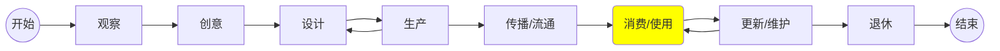

# 产品设计

## 产品的生命周期

## “梦幻”的商业创意

1. 顾客喜欢它。 -- 有用户价值
1. 它有可能变得非常大。 -- 可拓展
1. 它具有非常强大的回报潜力。 -- 有回报
1. 它能持续发展。 -- 可持续

-- Jeff Bezos

## 衡量好产品

* 直觉的。
* 省心的。
* 自然的。
* 零/轻负担的。

## 产品设计原则

1. 从核心业务出发：把所有精力都集中到这个中心上，把它做得越强越好，这是未来成功的基础。
1. 关注不变的因素：关注本质的、持久正确的因素，例如送货快速、物美价廉、简单易用、可靠性等。
1. 约定大于配置。
