# Cookie, Session, Token

## Cookie

HTTP 是无状态的，但常见的用户应用则是有状态的。为标记用户状态，Cookie 应运而生。它本质上是一种信息传输和存储约定。



服务端通过 HTTP 响应头 `Set-Cookie`，向客户端**设置**状态信息。

客户端通过 HTTP 请求头 `Cookie`，向服务端**传递**状态信息。

浏览器内置支持 Cookie 的能力：

* 接收到 `Set-Cookie` 响应头时，会自动将 Cookie 存储起来；
* 提供读写 Cookie 的 JavaScript 接口；
* 网页发起请求时，浏览器会自动将存储中的 Cookie 设置到请求头 `Cookie`中，发送给服务端。

### 格式和属性

```http
Set-Cookie: <name>=<value>; expires=<expired_at>; domain=<domain>; path=<path>; secure; httpOnly; samesite
```

| 属性 | 必填 | 默认值 | 说明 | 例子 |
| :--- | :---: | :--- | :--- | :--- |
| name | Y |  | 名称。 | userID=1 |
| value | Y |  | 值。 | userID=1 |
| expires |  |  | 有效截止日期。UTC +0 时区。默认时，浏览器关闭窗口即实效。 | expires=Tue, 19 Jan 2038 03:14:07 GMT |
| max-age |  |  | 有效时长，单位：秒。默认时，浏览器关闭窗口即实效。 | max-age=3600 |
| domain |  | 当前域名 | 有效域名范围。跨域无效。 | domain=example.com |
| path |  | 当前路径 | 有效路径范围。 | path=/ |
| secure |  |  | 仅 HTTPS 时才会发送。 |  |
| httpOnly |  |  | 前端 JavaScript 不能读写该 Cookie。 |  |
| samesite |  |  | 限制同源，即只有 AJAX 的请求域名和访问页面域名一致时，AJAX 才能发起请求。 |  |

了解[更多](https://javascript.info/cookie)。

## Session

基于 Cookie 的一种状态标记方法。前端存储唯一标识 \(Session\)，后台存储 Session 对用户 ID 的映射表。



特点：

* Cookie 轻量；
* 后台依赖映射表：为满足分布式架构和读写性能，一般存储于 Redis 等缓存数据库中。

注意：

* Session 的值需加密，否则容易伪造。

## Token

基于 Cookie 的一种状态标记方法。前端存储唯一标识 \(ID\) 和签名 \(校验\)。

特点：

* Cookie 容量较大；
* 后台根据 Token 本身的签名即可校验有效性，无映射表依赖。



### JSON Web Token

一种简单易用且成熟的 Token 实现方式，了解[更多](https://jwt.io)。

### 单点登录

有的企业可能有多于一个域名，但 Cookie 最大的可用范围只能是同一个域名。用户使用同一企业的不同域名应用时，为了无需多次登录，单点登录技术应运而生。

关键逻辑：

* 抽象出一个独立且企业级唯一的身份认证服务 \(SSO\)，负责身份认证、Token 生成、Token 校验等工作；
* 各应用将借助 SSO 生成的 Token 存储在自身域名下；
* 各应用服务端拿着从请求头中读取的 Token，去找 SSO 校验有效性。



## 参考

* [前端鉴权必须了解的5个兄弟：cookie、session、token、jwt、单点登录](https://mp.weixin.qq.com/s/hKL3haddZkIEHpNuUgWh3A)